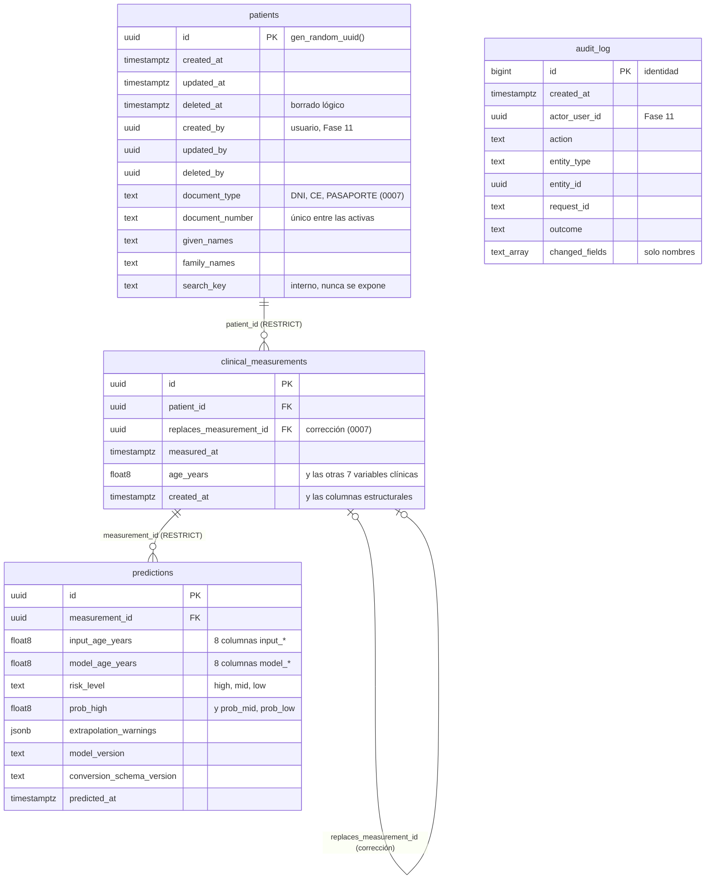

# ERD — Modelo de datos

- **Alcance de este documento:** las entidades que el negocio necesita y, desde
  la Fase 9, el **esquema físico implementado** (tablas, columnas, tipos,
  claves, índices y restricciones). La fuente de verdad del esquema son las
  migraciones de `migrations/`; este documento las describe.
  `tests/database/test_schema.py` consulta el catálogo de un PostgreSQL real y
  lo compara con el esquema esperado, que es el de la Sección 4 (el test no lee
  este documento: si uno cambia, el otro se actualiza a mano). La regla de trazabilidad de las predicciones
  pertenece a `docs/ML_SPEC.md`, Sección 6; aquí solo se referencia. Las reglas
  de protección de estos datos están en `docs/SECURITY.md`.
- **Fecha:** 2026-09-24 — Fase 3 (baseline documental), PR #5. Actualizado
  en la Fase 9 (base de datos), PR #8, y en la Fase 10 (persistencia
  clínica), PR #9.
- **Convención:** lo que aún no existe se marca
  **PENDIENTE (Fase N) — se documentará al implementarse**.

---

## 1. Estado

- **Esquema:** siete migraciones versionadas (`migrations/0001`–`0007`), cada
  una con su reversión. 0001–0006 son de la Fase 9 (la 0006 corrige la 0005
  tras la autorrevisión de PR #8, porque la 0005 ya estaba aplicada); la 0007,
  de la Fase 10 (Sección 6). Supabase (PostgreSQL 17.6, São Paulo).
- **Persistencia de datos clínicos:** desde la Fase 10 (PR #9). Los endpoints
  están en `docs/API_SPEC.md`, Sección 3.5.
- El dataset público de entrenamiento (`data/`) **no** es parte de este modelo
  de datos: no contiene pacientes de GynFem (`data/raw/README.md`).

## 2. Entidades

Derivadas de las historias de usuario (`docs/PRD.md`, Sección 4).

| Entidad | Qué necesita guardar el negocio | HU | Tabla |
| --- | --- | --- | --- |
| **Usuario** | Identidad de quien usa el sistema, su rol (Médico o Administrador) y si está activo | HU001, HU002 | **PENDIENTE (Fase 11).** El esquema la prevé: columnas `*_by` y `actor_user_id` (Sección 4.4) |
| **Paciente gestante** | Identidad mínima: tipo y número de documento, nombres y apellidos (Sección 6) | HU003, HU004 | `gynfem.patients` |
| **Registro de variables clínicas** | Las 8 variables en un momento dado, en unidades clínicas peruanas | HU005 | `gynfem.clinical_measurements` |
| **Evaluación (predicción)** | El resultado de clasificar un registro, con la trazabilidad de la Sección 3 | HU006–HU008 | `gynfem.predictions` |
| **Registro de auditoría** | Quién hizo qué acción, sobre qué y cuándo | Transversal | `gynfem.audit_log` |
| **Parámetros del sistema** | La configuración que el Administrador pueda ajustar | HU011 | **PENDIENTE (Fase 16)** |

HU009 (reportes) y HU010 (métricas ML) leen de estas tablas y de
`reports/ml/training_metrics.json`; que necesiten una entidad propia es
**PENDIENTE (Fase 16)**.

## 3. Regla fija de trazabilidad (aprobada)

Cada evaluación guarda los **cuatro** elementos que fija `docs/ML_SPEC.md`,
Sección 6, más los avisos de extrapolación emitidos. Cómo los guarda
`gynfem.predictions`:

| Elemento | Columnas |
| --- | --- |
| 1. Las 8 variables clínicas, en unidades clínicas peruanas | `input_<campo>`, un `double precision` por campo de `PredictionRequest` |
| 2. El vector que entró al modelo, en unidades del dataset y en el orden del contrato (`ML_SPEC.md`, Sección 9.6) | `model_<feature>`, un `double precision` por feature de `models/model_metadata.json`, en ese orden |
| 3. La versión del modelo | `model_version` (semver) |
| 4. La versión del esquema de conversión (`CONVERSION_SCHEMA_VERSION`) | `conversion_schema_version` (semver) |
| Avisos de extrapolación | `extrapolation_warnings` (`jsonb`, lista tal como la devuelve la API) |

`double precision` conserva exacto el float de Python: el test
`test_prediccion_real_se_guarda_y_se_reproduce` guarda una predicción real,
la relee bit a bit y vuelve a obtener las mismas probabilidades con el vector
guardado. Toda columna de trazabilidad es `NOT NULL`, y la fila es inmutable
(Sección 4.3).

## 4. Esquema implementado (Fase 9)

### 4.1 Diagrama

`audit_log` no tiene claves foráneas: `entity_id` apunta a filas de distintas
tablas según `entity_type`, y `actor_user_id` a los usuarios de la Fase 11.

### 4.2 Tablas

Todas están en el esquema **`gynfem`**, que la Data API de Supabase no expone
(`docs/SECURITY.md`, Sección 2.2).

**Columnas estructurales** de `patients`, `clinical_measurements` y
`predictions`:

| Columna | Tipo | Restricción |
| --- | --- | --- |
| `id` | `uuid` | PK, `DEFAULT gen_random_uuid()` (v4) |
| `created_at`, `updated_at` | `timestamptz` | `NOT NULL DEFAULT now()`; `updated_at` lo mantiene un trigger |
| `deleted_at` | `timestamptz` | Nulo; el borrado es lógico |
| `created_by`, `updated_by`, `deleted_by` | `uuid` | Nulos, sin clave foránea hasta la Fase 11 |

**`patients`** — las estructurales y, desde la migración 0007, la identidad
mínima (Sección 6):

| Columna | Tipo | Restricción |
| --- | --- | --- |
| `document_type` | `text` | `NOT NULL`, `IN ('DNI', 'CE', 'PASAPORTE')` |
| `document_number` | `text` | `NOT NULL`. DNI: `^[0-9]{8}$` (RENIEC). CE y pasaporte: `^[A-Z0-9]{4,20}$`, **regla provisional** pendiente de confirmar con GynFem |
| `given_names`, `family_names` | `text` | `NOT NULL`, de 1 a 100 caracteres sin contar espacios de los extremos |
| `search_key` | `text` | `NOT NULL`, no vacío. Nombres y apellidos normalizados (minúsculas, sin tildes) para la búsqueda; lo calcula el backend y **nunca se expone** |

Índice único parcial `(document_type, document_number) WHERE deleted_at IS NULL`:
un solo registro **activo** por documento.

**`clinical_measurements`**:

| Columna | Tipo | Restricción |
| --- | --- | --- |
| `patient_id` | `uuid` | `NOT NULL`, FK → `patients(id)` `ON DELETE RESTRICT ON UPDATE RESTRICT` |
| `measured_at` | `timestamptz` | `NOT NULL` |
| `age_years`, `temperature_c`, `heart_rate_bpm`, `systolic_bp_mmhg`, `diastolic_bp_mmhg`, `bmi_kg_m2`, `hba1c_percent`, `fasting_glucose_mg_dl` | `double precision` | `NOT NULL`; `CHECK` de valor finito (sin `NaN` ni infinito) |

Desde la migración 0007, además:

| Columna | Tipo | Restricción |
| --- | --- | --- |
| `replaces_measurement_id` | `uuid` | Nulo. FK → `clinical_measurements(id)` `RESTRICT`, `UNIQUE`: la medición que esta corrige (Sección 6). Nunca se expone |

Índice: `(patient_id, measured_at DESC)`.

**`predictions`**:

| Columna | Tipo | Restricción |
| --- | --- | --- |
| `measurement_id` | `uuid` | `NOT NULL`, FK → `clinical_measurements(id)` `RESTRICT`. Una medición puede tener varias predicciones (por ejemplo, reevaluada con otro modelo) |
| `input_*` (8) | `double precision` | `NOT NULL`, finitos |
| `model_*` (8) | `double precision` | `NOT NULL`, finitos |
| `risk_level` | `text` | `NOT NULL`, `IN ('high', 'mid', 'low')` |
| `prob_high`, `prob_mid`, `prob_low` | `double precision` | `NOT NULL`, en [0, 1], y `abs(suma − 1) < 1e-9` |
| `extrapolation_warnings` | `jsonb` | `NOT NULL DEFAULT '[]'`, debe ser una lista |
| `model_version`, `conversion_schema_version` | `text` | `NOT NULL`, formato `N.N.N` |
| `predicted_at` | `timestamptz` | `NOT NULL` |

Índices: `(measurement_id)` y `(predicted_at)`, este último para los reportes
de la Fase 16.

**`audit_log`**:

| Columna | Tipo | Restricción |
| --- | --- | --- |
| `id` | `bigint` | `GENERATED ALWAYS AS IDENTITY`, PK. Nunca aparece en una URL |
| `created_at`, `updated_at` | `timestamptz` | `NOT NULL DEFAULT now()`; `CHECK (updated_at = created_at)` (0006), porque la tabla es de solo inserción |
| `actor_user_id` | `uuid` | Nulo hasta la Fase 11 |
| `action` | `text` | `NOT NULL`, formato `entidad.accion` (`^[a-z_]+\.[a-z_]+$`). La lista de acciones la fija la Fase 10 |
| `entity_type` | `text` | `NOT NULL`, `IN ('patient', 'clinical_measurement', 'prediction')` |
| `entity_id` | `uuid` | Nulo |
| `request_id` | `text` | Nulo, `^[A-Za-z0-9-]{1,64}$` (el mismo formato que `X-Request-ID`) |
| `outcome` | `text` | `NOT NULL`, `IN ('success', 'denied', 'error')` |
| `changed_fields` | `text[]` | Nulo; solo nombres de campo (`^[a-z][a-z0-9_]*$`), nunca valores. «Ningún campo» se escribe `NULL`: la lista vacía `'{}'` se rechaza |

Índices: `(entity_type, entity_id)` y `(created_at)`.

La tabla de control del runner, `gynfem_migrations.schema_migrations`
(`version`, `name`, `checksum`, `applied_at`), vive en su propio esquema y
también tiene RLS (`docs/DEPLOYMENT.md`, Sección 6.2).

### 4.3 Reglas que impone la base

| Regla | Cómo | Test |
| --- | --- | --- |
| Nada se borra físicamente | Triggers `BEFORE DELETE` (por fila) y `BEFORE TRUNCATE` en las cuatro tablas | `test_borrado_fisico_rechazado` |
| Una predicción es inmutable | Trigger `predictions_immutable`: compara todas las columnas salvo `updated_*` y `deleted_*`, también las futuras | `test_prediccion_inmutable`, `test_prediccion_admite_el_borrado_logico` |
| La auditoría es de solo inserción | Trigger `audit_log_forbid_update` | `test_auditoria_solo_insercion` |
| `updated_at` se mantiene sola | Trigger `*_set_updated_at` | `test_updated_at_avanza_al_actualizar` |
| Sin `NaN` ni infinito | `CHECK (x > '-Infinity' AND x < 'Infinity')`: en PostgreSQL `NaN` es mayor que todo número | `test_no_finitos_rechazados_*` |
| La hora de la auditoría no la decide quien inserta | `CHECK (updated_at = created_at)` en `audit_log` (0006) | `test_la_hora_de_la_auditoria_no_la_decide_quien_inserta` |
| Una baja lógica no se deshace ni se reescribe | Trigger `*_guard` en `patients` y `clinical_measurements` (0007); en `predictions`, su trigger de inmutabilidad | `test_la_baja_no_se_puede_deshacer_ni_reescribir` |
| `created_at` y `created_by` son inmutables | Trigger `*_guard` (0007) | `test_created_es_inmutable` |
| Los valores de una medición son inmutables: se corrigen con una medición nueva | Trigger `clinical_measurements_guard` (0007) | `test_los_valores_de_una_medicion_son_inmutables` |
| Una medición se corrige una sola vez | `UNIQUE (replaces_measurement_id)` (0007); la API responde 409 | `test_una_medicion_solo_se_corrige_una_vez`, `test_corregir_dos_veces_la_misma_409` |
| Un documento activo por paciente | Índice único parcial (0007) | `test_un_documento_activo_por_paciente` |
| RLS y ningún privilegio para `anon` ni `authenticated` | `ENABLE ROW LEVEL SECURITY` y `REVOKE` en la misma migración que crea cada tabla | `test_rls_habilitado_en_todas_las_tablas`, `test_roles_de_la_data_api_*` |
| Ninguna contraseña | Ninguna columna se llama como una contraseña, un hash o un secreto | `test_ninguna_tabla_tiene_campos_de_contrasena` |

Los puntos que esta sección dejaba pendientes para la Fase 10 están resueltos
en la Sección 6.

**Sin límites fisiológicos en la base.** Su única fuente es
`app/services/clinical_limits.py` y son provisionales (`ML_SPEC.md`,
Sección 5.1): duplicarlos en un `CHECK` obligaría a migrar cada vez que el
equipo médico los valide.

### 4.4 Relación prevista con los usuarios (Fase 11)

Supabase Auth guarda los usuarios en `auth.users`. La Fase 11 creará una
tabla de perfil (rol, activo) con `id` → `auth.users(id)` y añadirá las claves
foráneas desde `created_by`, `updated_by`, `deleted_by` y `actor_user_id`.
Como hoy esas columnas son nulas, añadir las claves no requiere migrar datos.

## 5. Decisiones de la Fase 9

Resuelven los puntos que la Sección 4 de la versión anterior dejaba abiertos.

| Pregunta | Decisión | Motivo |
| --- | --- | --- |
| ¿Registro de variables y evaluación son una o dos entidades? | **Dos**, y la predicción **copia** la entrada clínica (`input_*`) | `ML_SPEC.md`, Sección 6, exige que cada predicción guarde las 8 variables. Si HU005 corrige una medición, la predicción ya emitida sigue siendo reproducible |
| ¿Cómo se versiona el esquema de conversión? | Columna `conversion_schema_version` con el valor de `CONVERSION_SCHEMA_VERSION` (`app/services/unit_conversion.py`) | Reutiliza la versión que ya viaja en cada respuesta |
| ¿Qué parte de la auditoría vive en la base y cuál en los logs? | En la base, los eventos de negocio sin valores (`audit_log`). En los logs, los eventos técnicos, como hasta ahora | `docs/SECURITY.md`, Sección 2 |
| ¿Entero o UUID? | **UUID v4** generado por la base. `bigint` solo en `audit_log` | Un entero en una URL (`/pacientes/2`) permite recorrer la numeración y revela cuántas pacientes hay |
| ¿Vector del modelo en columnas o en `jsonb`? | **Columnas tipadas** | `NOT NULL` por feature y consultables para los reportes. Un modelo con otras features exigirá una migración, lo cual es deseable |
| ¿`numeric` o `double precision`? | **`double precision`** | Conserva exacto el float que usó el modelo (por ejemplo, `33.311592000000005`) |
| ¿Esquema `public`? | **No: `gynfem`** | `public` lo expone la Data API con la anon key, que es pública |

## 6. Decisiones de la Fase 10

| Pregunta | Decisión | Motivo |
| --- | --- | --- |
| **A.** ¿Qué identifica a una paciente? | Cuatro campos obligatorios: `document_type`, `document_number`, `given_names`, `family_names`. **Sin fecha de nacimiento** ni contacto | Minimización: solo lo necesario para la atención. El documento es la clave natural en el Perú; CE y pasaporte cubren a gestantes extranjeras. La edad ya se registra en cada medición (`age_years`, la entrada del modelo): guardar también la fecha de nacimiento crearía dos fuentes que pueden contradecirse |
| **B.** ¿Medición y predicción, juntas o separadas? | **Una operación**: `POST /patients/{id}/measurements` predice y guarda medición, predicción y auditoría en una transacción | El médico toma las variables para conocer el riesgo: una acción, un resultado. Toda medición que pasa el nivel a se puede predecir, así que una «medición sin predicción» no tiene caso de uso. No quedan mediciones huérfanas. Coste aceptado: no se puede guardar una medición sin predecir |
| **C.** ¿Se corrige una medición ya usada para predecir? | **Sí, con una medición nueva** que apunta a la original (`replaces_measurement_id`), que queda dada de baja en la misma transacción. La predicción original se conserva intacta | El médico pudo decidir con esa evaluación: reescribirla falsearía el registro. Como en la historia clínica, no se borra, se enmienda. La predicción original sigue siendo reproducible, porque copia su entrada (`input_*`) |
| **F.** ¿El borrado lógico se puede deshacer? | **No.** La baja no se deshace ni se reescribe (trigger) | Sin autenticación ni roles, una reactivación no dejaría rastro fiable. Si el producto quiere reactivar pacientes, será una acción del Administrador (Fase 11), con su migración y su auditoría. Una paciente dada de baja por error puede volver a registrarse con el mismo documento |
| **F.** ¿`created_*` es inmutable? | **Sí**, en `patients` y `clinical_measurements` | Es la procedencia del registro |
| **F.** ¿`audit_log.request_id` del servidor o del cliente? | **El mismo `request_id` del log** | Su propósito es correlacionar auditoría y logs; uno propio de la auditoría rompería esa correlación. Su formato (`[A-Za-z0-9-]{1,64}`) impide un valor clínico en claro. Riesgo residual documentado: lo puede elegir el cliente (`docs/API_SPEC.md`, Sección 2.6) |
