# Perfil del dataset — Mathernal Risk (RAW)

- **Fecha de generación:** 2026-09-21
- **SHA-256 del RAW:** `2d5b35af3c401329ce3dfd8ef0fb48057f66570e7bae24f6f40c970cb012ae0b`
- **Python:** 3.12.10
- **pandas:** 3.0.6
- **Comando para regenerar:** `.venv\Scripts\python.exe scripts\profile_dataset.py`

## 1. Estructura

- Filas: **6103**
- Columnas: **11**
- Formato de fin de línea del archivo RAW: CRLF consistente (6104 líneas)
- Uso de memoria (deep): **1,132,481 bytes** (1105.9 KiB)
- Variables clínicas identificadas (todas las columnas excepto `Patient ID`, `Name`, `Status`): **8**

| Columna | repr() exacto | Tipo inferido | Observación |
| --- | --- | --- | --- |
| `Patient ID` | 'Patient ID' | int64 | — |
| `Name` | 'Name' | str | — |
| `Age` | 'Age' | int64 | — |
| `Body Temperature(F) ` | 'Body Temperature(F) ' | float64 | ⚠️ espacio(s) sobrante(s) |
| `Heart rate(bpm)` | 'Heart rate(bpm)' | int64 | — |
| `Systolic Blood Pressure(mm Hg)` | 'Systolic Blood Pressure(mm Hg)' | int64 | — |
| `Diastolic Blood Pressure(mm Hg)` | 'Diastolic Blood Pressure(mm Hg)' | int64 | — |
| `BMI(kg/m 2)` | 'BMI(kg/m 2)' | float64 | — |
| `Blood Glucose(HbA1c)` | 'Blood Glucose(HbA1c)' | int64 | — |
| `Blood Glucose(Fasting hour-mg/dl)` | 'Blood Glucose(Fasting hour-mg/dl)' | float64 | — |
| `Status` | 'Status' | str | — |

## 2. Calidad de datos

### Nulos por columna

| Columna | Nulos |
| --- | --- |
| `Patient ID` | 0 |
| `Name` | 0 |
| `Age` | 0 |
| `Body Temperature(F) ` | 0 |
| `Heart rate(bpm)` | 0 |
| `Systolic Blood Pressure(mm Hg)` | 0 |
| `Diastolic Blood Pressure(mm Hg)` | 0 |
| `BMI(kg/m 2)` | 0 |
| `Blood Glucose(HbA1c)` | 0 |
| `Blood Glucose(Fasting hour-mg/dl)` | 0 |
| `Status` | 0 |

### Duplicados

- Filas exactamente duplicadas (todas las columnas): **0**
- Filas duplicadas usando solo las 8 variables clínicas: **2** (1 grupo(s))
- Conflictos de etiqueta (mismas 8 variables clínicas, distinto `Status`): **0** grupo(s)

### Identificadores

- `Patient ID` es único: **True** (duplicados: 0)
- Columna `Name` presente: **True**. Conteo de valores no nulos: **6103**. Por política del proyecto, su contenido nunca se imprime en este reporte.

## 3. Variable objetivo (`Status`)

| Clase | Conteo | Porcentaje |
| --- | --- | --- |
| `high risk` | 2059 | 33.74% |
| `mid risk` | 2043 | 33.48% |
| `low risk` | 2001 | 32.79% |

## 4. Estadísticos descriptivos por variable

| Variable | Min | Max | Media | Mediana | Desv. Est. | Q1 | Q3 |
| --- | --- | --- | --- | --- | --- | --- | --- |
| `Age` | 15.000 | 250.000 | 26.425 | 25.000 | 6.390 | 22.000 | 30.000 |
| `Body Temperature(F) ` | 39.600 | 104.000 | 98.666 | 98.600 | 1.591 | 98.600 | 98.800 |
| `Heart rate(bpm)` | 45.000 | 150.000 | 86.101 | 80.000 | 22.628 | 72.000 | 91.000 |
| `Systolic Blood Pressure(mm Hg)` | 90.000 | 169.000 | 129.218 | 128.000 | 17.234 | 120.000 | 141.000 |
| `Diastolic Blood Pressure(mm Hg)` | 9.000 | 142.000 | 87.258 | 87.000 | 7.793 | 82.000 | 92.000 |
| `BMI(kg/m 2)` | 14.900 | 27.900 | 21.436 | 21.300 | 2.157 | 19.600 | 23.100 |
| `Blood Glucose(HbA1c)` | 30.000 | 50.000 | 37.904 | 38.000 | 4.400 | 34.000 | 41.000 |
| `Blood Glucose(Fasting hour-mg/dl)` | 3.500 | 8.900 | 5.505 | 5.700 | 0.905 | 4.800 | 6.000 |

## 5. Estadísticos descriptivos por variable y clase

### `low risk` (n=2001)

| Variable | Min | Max | Media | Mediana | Desv. Est. | Q1 | Q3 |
| --- | --- | --- | --- | --- | --- | --- | --- |
| `Age` | 19.000 | 250.000 | 24.365 | 24.000 | 5.932 | 22.000 | 27.000 |
| `Body Temperature(F) ` | 39.600 | 98.600 | 98.570 | 98.600 | 1.319 | 98.600 | 98.600 |
| `Heart rate(bpm)` | 69.000 | 90.000 | 78.297 | 78.000 | 5.941 | 73.000 | 83.000 |
| `Systolic Blood Pressure(mm Hg)` | 120.000 | 141.000 | 127.763 | 127.000 | 6.320 | 122.000 | 133.000 |
| `Diastolic Blood Pressure(mm Hg)` | 75.000 | 93.000 | 84.360 | 84.000 | 3.036 | 82.000 | 87.000 |
| `BMI(kg/m 2)` | 18.500 | 27.000 | 21.089 | 20.900 | 1.912 | 19.300 | 22.600 |
| `Blood Glucose(HbA1c)` | 30.000 | 42.000 | 36.701 | 37.000 | 3.115 | 34.000 | 39.000 |
| `Blood Glucose(Fasting hour-mg/dl)` | 3.600 | 6.700 | 5.088 | 5.200 | 0.717 | 4.500 | 5.800 |

### `mid risk` (n=2043)

| Variable | Min | Max | Media | Mediana | Desv. Est. | Q1 | Q3 |
| --- | --- | --- | --- | --- | --- | --- | --- |
| `Age` | 18.000 | 36.000 | 27.447 | 27.000 | 5.073 | 22.000 | 32.000 |
| `Body Temperature(F) ` | 95.100 | 101.900 | 98.555 | 98.600 | 1.015 | 98.600 | 98.800 |
| `Heart rate(bpm)` | 61.000 | 139.000 | 86.220 | 82.000 | 17.874 | 73.000 | 91.000 |
| `Systolic Blood Pressure(mm Hg)` | 100.000 | 159.000 | 129.364 | 129.000 | 17.507 | 115.000 | 143.000 |
| `Diastolic Blood Pressure(mm Hg)` | 71.000 | 99.000 | 88.692 | 88.000 | 6.388 | 83.000 | 94.000 |
| `BMI(kg/m 2)` | 18.500 | 26.800 | 21.529 | 21.600 | 1.909 | 19.700 | 23.100 |
| `Blood Glucose(HbA1c)` | 30.000 | 46.000 | 38.184 | 38.000 | 4.367 | 34.000 | 42.000 |
| `Blood Glucose(Fasting hour-mg/dl)` | 3.800 | 6.900 | 5.697 | 5.800 | 0.809 | 5.300 | 6.300 |

### `high risk` (n=2059)

| Variable | Min | Max | Media | Mediana | Desv. Est. | Q1 | Q3 |
| --- | --- | --- | --- | --- | --- | --- | --- |
| `Age` | 15.000 | 48.000 | 27.413 | 26.000 | 7.430 | 22.000 | 33.000 |
| `Body Temperature(F) ` | 93.000 | 104.000 | 98.867 | 98.600 | 2.175 | 97.700 | 100.000 |
| `Heart rate(bpm)` | 45.000 | 150.000 | 93.567 | 90.000 | 32.432 | 67.000 | 124.000 |
| `Systolic Blood Pressure(mm Hg)` | 90.000 | 169.000 | 130.488 | 126.000 | 23.110 | 110.000 | 156.000 |
| `Diastolic Blood Pressure(mm Hg)` | 9.000 | 142.000 | 88.650 | 88.000 | 10.885 | 82.000 | 96.000 |
| `BMI(kg/m 2)` | 14.900 | 27.900 | 21.680 | 21.600 | 2.538 | 19.600 | 23.600 |
| `Blood Glucose(HbA1c)` | 30.000 | 50.000 | 38.797 | 38.000 | 5.175 | 35.000 | 42.000 |
| `Blood Glucose(Fasting hour-mg/dl)` | 3.500 | 8.900 | 5.719 | 5.800 | 1.014 | 5.000 | 6.300 |

## 6. Verificación de unidades

### `Blood Glucose(HbA1c)`

Los valores observados (min=30.0, max=50.0, media=37.9) caen fuera del rango clínicamente posible para % (típicamente 3.5–15.0%) y sí son consistentes con **mmol/mol (IFCC)**, cuyo rango típico es 20.0–75.0. Conclusión: la columna `Blood Glucose(HbA1c)` está en **mmol/mol**, no en %.

### `Blood Glucose(Fasting hour-mg/dl)`

El header indica `mg/dl`, pero los valores observados (min=3.5, max=8.9, media=5.5) son demasiado bajos para mg/dL (rango fisiológico plausible 50.0–300.0) y sí encajan en **mmol/L** (rango plausible 2.5–16.5). Conclusión: la columna `Blood Glucose(Fasting hour-mg/dl)` está en **mmol/L**, pese a que el nombre dice mg/dl.

## 7. Outliers (reglas del paper, solo diagnóstico)

Ninguna fila fue eliminada de `data/raw/`; esto es un diagnóstico.

| Regla | Filas marcadas |
| --- | --- |
| Edad > 100 | 1 |
| Temperatura fuera de 95–105 °F | 43 |
| Diastólica < 50 mmHg | 1 |
| **Unión (cualquier regla)** | 45 |

### Desglose de la regla de temperatura

| Valor (°F) | Clase | Conteo | ≈°C |
| --- | --- | --- | --- |
| 39.6 | `low risk` | 1 | 4.2 |
| 93.0 | `high risk` | 2 | 33.9 |
| 93.9 | `high risk` | 1 | 34.4 |
| 94.0 | `high risk` | 10 | 34.4 |
| 94.1 | `high risk` | 3 | 34.5 |
| 94.2 | `high risk` | 3 | 34.6 |
| 94.3 | `high risk` | 2 | 34.6 |
| 94.4 | `high risk` | 2 | 34.7 |
| 94.5 | `high risk` | 2 | 34.7 |
| 94.6 | `high risk` | 6 | 34.8 |
| 94.7 | `high risk` | 3 | 34.8 |
| 94.8 | `high risk` | 3 | 34.9 |
| 94.9 | `high risk` | 5 | 34.9 |

De las 43 filas marcadas por la regla de temperatura, **42** son `high risk` con 93.0–94.9 °F (≈33.9–34.9 °C): hipotermia clínicamente plausible; **1** es `low risk` con 39.6 °F (≈4.2 °C): valor imposible en °F (por debajo de 70°F), probable registro en °C.

- Filas que quedarían si se aplicaran estas reglas: **6058**

| Clase | Conteo resultante |
| --- | --- |
| low | 1999 |
| mid | 2043 |
| high | 2016 |

**Comparación con el paper** (45 eliminadas, 6058 restantes; 2016 high, 2043 mid, 1999 low):

Coincide exactamente con lo reportado en el paper.

## 8. Correlaciones de Pearson (variables clínicas)

| Variable | `Age` | `Body Temperature(F) ` | `Heart rate(bpm)` | `Systolic Blood Pressure(mm Hg)` | `Diastolic Blood Pressure(mm Hg)` | `BMI(kg/m 2)` | `Blood Glucose(HbA1c)` | `Blood Glucose(Fasting hour-mg/dl)` |
| --- | --- | --- | --- | --- | --- | --- | --- | --- |
| `Age` | 1.000 | 0.088 | 0.157 | -0.094 | 0.156 | 0.114 | 0.116 | 0.053 |
| `Body Temperature(F) ` | 0.088 | 1.000 | 0.006 | -0.006 | 0.085 | 0.108 | 0.048 | 0.009 |
| `Heart rate(bpm)` | 0.157 | 0.006 | 1.000 | 0.195 | 0.282 | 0.129 | 0.049 | 0.073 |
| `Systolic Blood Pressure(mm Hg)` | -0.094 | -0.006 | 0.195 | 1.000 | 0.235 | 0.036 | 0.071 | -0.051 |
| `Diastolic Blood Pressure(mm Hg)` | 0.156 | 0.085 | 0.282 | 0.235 | 1.000 | 0.183 | 0.083 | 0.095 |
| `BMI(kg/m 2)` | 0.114 | 0.108 | 0.129 | 0.036 | 0.183 | 1.000 | 0.074 | 0.004 |
| `Blood Glucose(HbA1c)` | 0.116 | 0.048 | 0.049 | 0.071 | 0.083 | 0.074 | 1.000 | 0.012 |
| `Blood Glucose(Fasting hour-mg/dl)` | 0.053 | 0.009 | 0.073 | -0.051 | 0.095 | 0.004 | 0.012 | 1.000 |

## 9. Leakage vía `Patient ID` u orden de filas

- `Patient ID` es una secuencia estrictamente consecutiva (paso +1, sin huecos): **True** → equivale al orden de fila, no aporta información clínica.
- Correlación de Pearson entre `Patient ID` y `Status` (codificado ordinalmente low=0, mid=1, high=2): **-0.0030**
- Correlación de Pearson entre la posición de fila y `Status` (misma codificación): **-0.0030**

Ambas correlaciones son cercanas a cero: no hay evidencia de que el orden de filas o `Patient ID` codifiquen la clase. Aun así, `Name` y `Patient ID` deben excluirse del modelo: `Name` por ser dato personal identificable y `Patient ID` por ser un identificador secuencial sin significado clínico (riesgo de overfitting/leakage si el pipeline de producción asigna IDs en un orden distinto).

## 10. Figuras

### `Age`

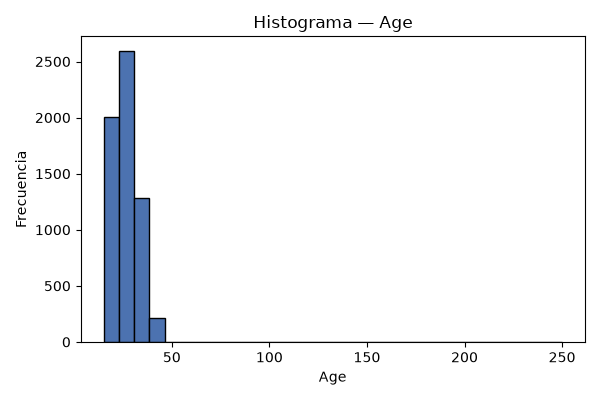

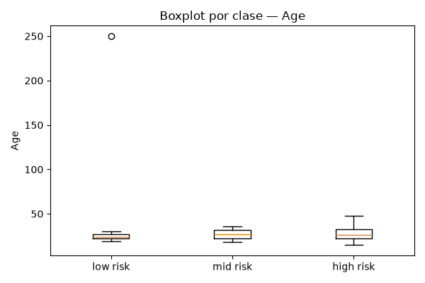

### `Body Temperature(F) `

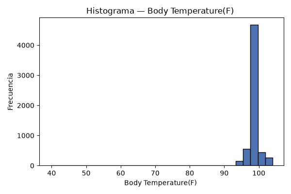

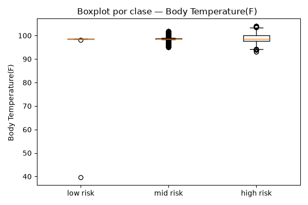

### `Heart rate(bpm)`

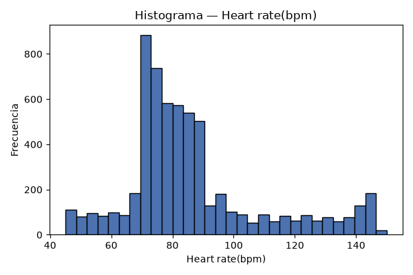

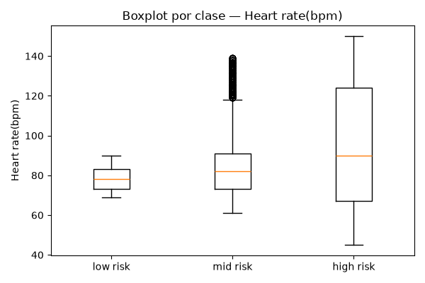

### `Systolic Blood Pressure(mm Hg)`

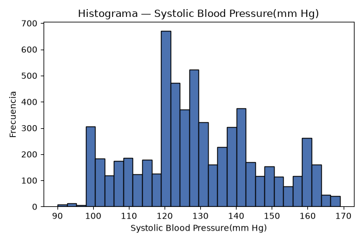

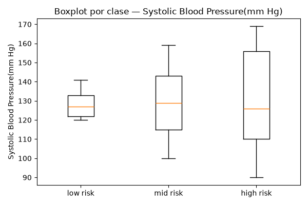

### `Diastolic Blood Pressure(mm Hg)`

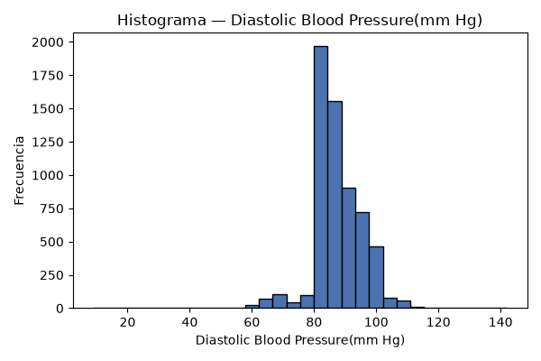

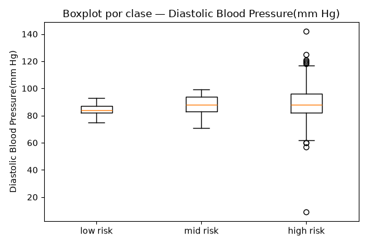

### `BMI(kg/m 2)`

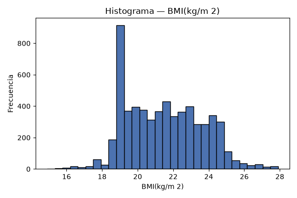

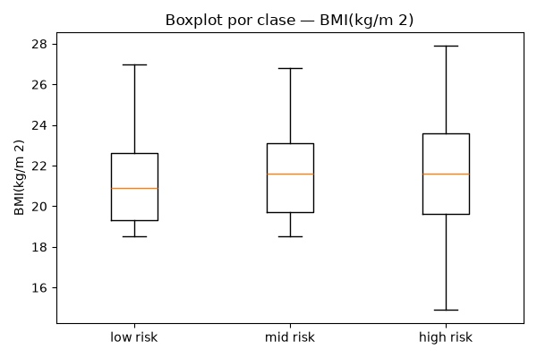

### `Blood Glucose(HbA1c)`

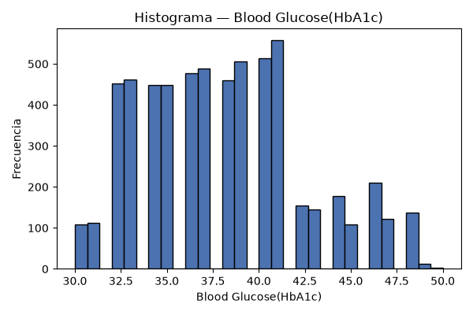

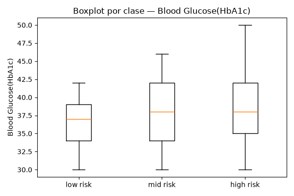

### `Blood Glucose(Fasting hour-mg/dl)`

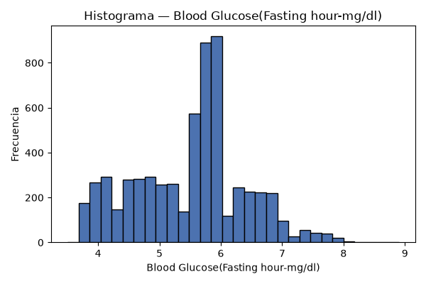

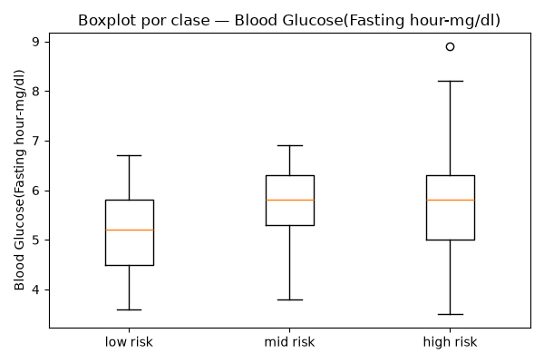

## 11. Hallazgos y decisiones pendientes (para PR #2)

1. Hay 2 filas (1 grupo(s)) que comparten idénticas las 8 variables clínicas (Patient ID involucrados: [3543, 3638]). Decidir si se deduplican antes de entrenar.
2. Las columnas con espacios sobrantes en el nombre ('Body Temperature(F) ') deben normalizarse en PR #2.
3. La columna `Blood Glucose(HbA1c)` no declara unidad y los valores indican mmol/mol, no %. Documentar o renombrar en PR #2.
4. El header dice mg/dl pero los valores están en mmol/L. En PR #2 se renombrará la columna para reflejar la unidad real; NO se convertirán valores (decisión aprobada: la conversión desde unidades clínicas vive en el backend).
5. Las reglas de outliers del paper marcan 45 filas (edad>100: 1, temperatura fuera de rango: 43, diastólica<50: 1). Decidir en PR #2 si se eliminan, se corrigen o se tratan como missing.
6. Decidir en PR #2 si se aplica la regla de temperatura del paper completa (elimina 42 casos high risk con hipotermia plausible) o solo se eliminan los valores fisiológicamente imposibles (edad 250, temperatura 39.6 °F, diastólica 9). Documentar la decisión con esta evidencia.
